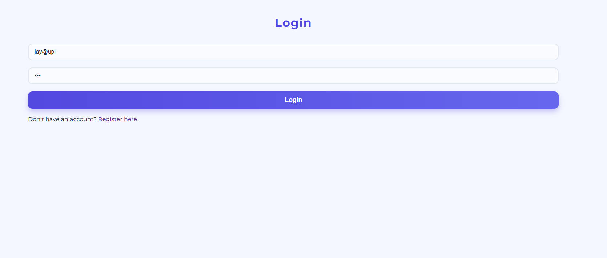
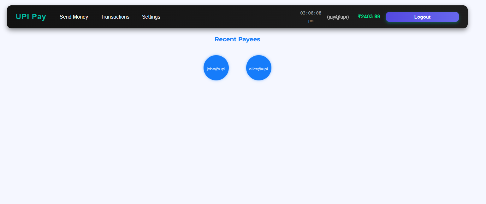
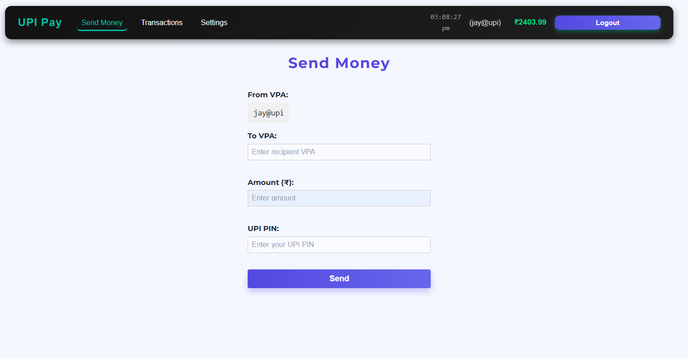
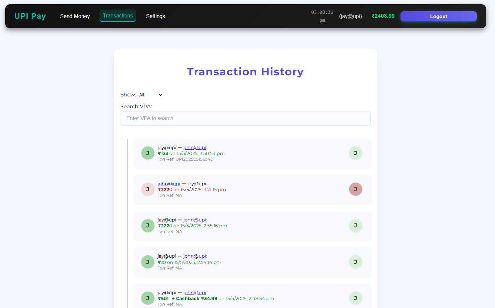

# UPI Payments Frontend (React + Vite)

This is the frontend application for a UPI (Unified Payments Interface) simulation system. It allows users to send money, manage UPI PIN, view transactions, and more. Built using React and Vite with custom CSS.

## 🚀 Features

### ✅ Authentication
- User login and registration
- Secure UPI PIN setup and update
- JWT-based authentication flow

### ✅ User Settings
- Set or update UPI PIN
- Change Virtual Payment Address (VPA)

### ✅ Send Money
- Send money to any VPA
- PIN validation before transfer
- Auto-generate transaction reference ID (e.g., `UPI202505160001`)
- Smart VPA suggestions based on recent transactions

### ✅ Transaction History
- View complete transaction log (sent and received)
- Filter by:
  - Date range
  - Sent / Received
  - Amount (min / max)
- Search by VPA
- See cashback earned
- Transaction reference ID shown for every transaction

### ✅ Recent VPAs
- Displays most recently used VPAs
- One-click to re-initiate transfer

### 🔜 Upcoming Features
- Export transactions to CSV
- Mark VPAs as Favorites
- Pagination and performance improvements
- Visual enhancements with loading spinners, toasts, and form validations

## 🛠️ Tech Stack
- **Frontend Framework:** React + Vite
- **Styling:** Custom CSS (No Tailwind)
- **State Management:** React Hooks, Context API
- **Routing:** React Router DOM
- **HTTP Requests:** Axios with auth interceptors
- **Animations:** Framer Motion

## 🧩 Folder Structure
```
src/
│
├── components/
│ ├── SendMoneyForm.jsx
│ ├── Transactions.jsx
│ ├── UserSettings.jsx
│ └── RecentSentVPAs.jsx
│
├── context/
│ └── AuthContext.jsx
│
├── hooks/
│ └── useDebounce.js
│
├── utils/
│ └── api.js # Axios instance
│
├── App.jsx
├── main.jsx
└── routes.jsx
```

## 📦 Installation

1. Clone the repo:
   ```bash
   git clone https://github.com/yourusername/upi-frontend.git
   cd upi-frontend
   ```

2. Install dependencies:
   ```bash
   npm install
   ```

3. Set environment variable:
   Create a .env file with the backend URL:
   ```ini
   VITE_API_URL=http://localhost:5000
   ```

4. Run the development server:
   ```bash
   npm run dev
   ```

## 🔗 Backend Repository

The backend code for this project is available at [github.com/yourusername/upi-backend](https://github.com/yourusername/upi-backend)

## 📸 Screenshots

<details>
<summary>Click to view screenshots</summary>






</details>

## 🧪 Running Tests

```bash
npm test
```

## 🚀 Deployment

Build the application for production:

```bash
npm run build
```

The built files will be in the `dist` directory ready for deployment.

## 👥 Contributing

Contributions are welcome! Please feel free to submit a Pull Request.

1. Fork the repository
2. Create your feature branch (`git checkout -b feature/amazing-feature`)
3. Commit your changes (`git commit -m 'Add some amazing feature'`)
4. Push to the branch (`git push origin feature/amazing-feature`)
5. Open a Pull Request

## 📄 License

This project is licensed under the MIT License - see the [LICENSE](LICENSE) file for details.

## 📧 Contact

Your Name - [@yourtwitter](https://twitter.com/yourtwitter) - email@example.com

Project Link: [https://github.com/yourusername/upi-frontend](https://github.com/yourusername/upi-frontend)
